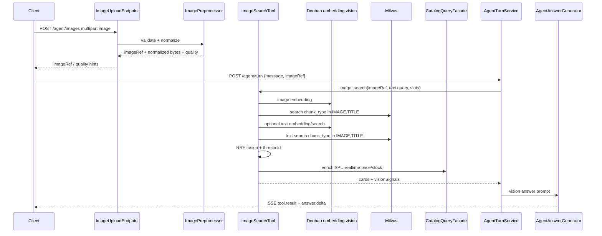

# W3 多模态拍照找货技术方案

> 对应核心加分项 2：用户上传街拍 / 商品图后，系统识别图片主体，在商品库内召回同款、相似款和同风格同色系商品，并在低置信度场景主动反问。

## 1. 目标与范围

W3 的目标不是新增一条孤立的图片检索接口，而是把「拍照找货」接入现有 Agent 主链路：

```text
图片上传 -> 服务端校验 / 预处理 -> Doubao-embedding-vision -> Milvus IMAGE/TITLE 检索
       -> 与文本意图检索做 RRF 融合 -> 商品卡片 -> Answer Prompt 视觉解释
```

功能覆盖：

- 支持 `multipart/form-data` 上传图片，限制最大 5MB，最长边不超过 1024 px。
- 服务端兜底裁切、缩放、亮度归一，客户端仍优先压缩和预处理。
- 使用 Doubao-embedding-vision 将用户图编码到统一多模态向量空间。
- Milvus 检索范围限定在 `chunk_type IN (IMAGE, TITLE)`，避免正文描述噪声干扰视觉召回。
- 图片向量检索与文本向量检索两路结果通过 RRF 融合。
- 对模糊、主体不清晰、视觉分低的图片返回反问提示。
- Answer Prompt 增加 vision 分支，解释「同款 / 相似款 / X 风格 / 同色系」推荐理由。
- 建立 10 张街拍 / 商品图专项评测集，标注期望同款 SPU。

## 2. 现有基础

当前代码库已经具备 W3 可复用能力：

- 商品 Agent 主流程：`AgentTurnService` 负责 intent、slot、tool、answer 的端到端编排。
- 商品检索工具：`SearchProductsToolCallback` 已能从 `ProductSearchSpi` 召回并回填实时 SPU 卡片。
- Milvus 检索：`RagMilvusRetriever` 已支持向量检索、metadata 过滤、generation 对齐。
- Chunk 类型：`RagChunkMetadataView.chunkType` 已支持 `TITLE / ATTR / DESC / REVIEW / IMAGE / BODY`。
- Doubao 视觉 embedding 配置：`RagConfiguration` 已有 embedding 绑定与维度一致性日志。
- Answer 生成：`AgentAnswerGenerator` 读取 `prompts/agent-answer-v1.txt`，可扩展 vision 分支。

因此 W3 主要新增 `agent.image` 或 `agent.vision` 能力，不重写既有 RAG 主链路。

## 3. 总体架构



## 4. 接口设计

### 4.1 ImageUploadEndpoint

新增控制器建议放在：

```text
src/main/java/com/bytedance/ai/agent/web/ImageUploadEndpoint.java
```

接口：

```http
POST /agent/images
Content-Type: multipart/form-data

file=<image>
conversationId=<optional>
requestId=<optional>
```

响应：

```json
{
  "imageRef": "img_01HX...",
  "width": 768,
  "height": 1024,
  "contentType": "image/jpeg",
  "sizeBytes": 418203,
  "quality": {
    "blurScore": 0.82,
    "brightness": 0.54,
    "subjectConfidence": 0.76
  },
  "warnings": []
}
```

校验规则：

| 规则 | 策略 |
| --- | --- |
| 文件大小 | 原始 multipart 文件 `<= 5MB`，超限返回 `413 IMAGE_TOO_LARGE` |
| 图片格式 | 仅允许 `jpeg/png/webp`，通过 magic bytes 校验，不信任扩展名 |
| 尺寸 | 解码后最长边 `<= 1024`；超过则服务端缩放，若仍异常返回 `422 IMAGE_DIMENSION_INVALID` |
| 安全 | 禁止 SVG、动图多帧仅取首帧；剥离 EXIF |
| 存储 | Demo 可用内存 / 本地临时文件；生产建议对象存储，`imageRef` 只保存短期引用 |

### 4.2 AgentTurnRequest 扩展

在 `AgentTurnRequest` 增加可选字段：

```java
List<String> imageRefs
```

兼容策略：

- 无 `imageRefs` 时保持现有文本 Agent 行为。
- 有 `imageRefs` 且用户消息为空或包含「找同款 / 这种 / 类似」时，intent 识别为 `IMAGE_SEARCH`。
- 有图片也有文本时，文本作为融合检索的第二路 query，例如「找这种黑色通勤包，预算 500」。

## 5. ImagePreprocessor

新增服务建议放在：

```text
src/main/java/com/bytedance/ai/agent/vision/ImagePreprocessor.java
```

处理流水线：

1. 解码图片，校验格式、尺寸、通道数。
2. 根据最长边缩放到 `<= 1024`，保持宽高比。
3. 中心裁切兜底：当图片极端长图或主体占比过小时，裁出中心正方形副本作为 embedding 备选。
4. 亮度归一：对过暗 / 过曝图做轻量 gamma / histogram normalize。
5. 质量评估：
   - `blurScore`：Laplacian variance 归一化。
   - `brightness`：平均亮度归一化。
   - `subjectConfidence`：第一版可用启发式，后续接视觉模型主体检测。
6. 输出 `ProcessedImage`：

```java
record ProcessedImage(
        String imageRef,
        byte[] normalizedBytes,
        String contentType,
        int width,
        int height,
        ImageQuality quality
) {}
```

低质量策略：

- 严重模糊：不进入检索，直接返回 `IMAGE_LOW_QUALITY`。
- 轻度问题：继续检索，但在 `visionSignals.warnings` 中带上提醒。

## 6. ImageSearchTool

新增工具建议放在：

```text
src/main/java/com/bytedance/ai/agent/tool/impl/ImageSearchToolCallback.java
```

工具 schema：

```json
{
  "type": "object",
  "properties": {
    "imageRefs": {"type": "array", "items": {"type": "string"}},
    "query": {"type": "string"},
    "slots": {"type": "object"},
    "topK": {"type": "integer", "minimum": 1, "maximum": 10}
  },
  "required": ["imageRefs"]
}
```

工具输出：

```json
{
  "toolName": "image_search",
  "cards": [],
  "visionSignals": {
    "bestVisualScore": 0.78,
    "confidence": "HIGH",
    "matchType": "SIMILAR_STYLE",
    "warnings": []
  },
  "facetsApplied": {
    "chunkTypes": ["IMAGE", "TITLE"],
    "fusion": "RRF"
  }
}
```

检索步骤：

1. 读取 `imageRef` 对应的 `ProcessedImage`。
2. 调 Doubao-embedding-vision 得到用户图向量。
3. 构造 Milvus native expression：

```text
sourceUri like "catalog://spu/%" && chunk_type in ["IMAGE", "TITLE"]
```

实际字段以当前 Milvus metadata key 为准，若 `chunkType` 存在于 JSON metadata，则由 `RagMilvusNativeExpressionBuilder` 增强支持。

4. 图片向量检索：`imageVector -> top 50`。
5. 文本向量检索：若 `query` 非空，则 `queryText -> top 50`，同样限制 `IMAGE/TITLE`。
6. RRF 融合并按 SPU 聚合。
7. 通过 `CatalogQueryFacade` 回填实时价格、库存、图片。
8. 根据视觉分和质量分判断是否低置信度。

## 7. Milvus 检索与 chunk_type 过滤

### 7.1 为什么限定 IMAGE/TITLE

拍照找货要优先匹配外观、款式、颜色、品类。`DESC / ATTR / REVIEW` 容易召回「文字描述相似但视觉无关」商品，例如同样写着「通勤、百搭」的包和鞋。因此 W3 视觉检索默认只查：

```text
chunk_type IN (IMAGE, TITLE)
```

推荐权重：

| chunk_type | 用途 | 权重 |
| --- | --- | --- |
| IMAGE | 主视觉相似，同款 / 相似款核心依据 | 1.00 |
| TITLE | 品类、品牌、款式名称补强 | 0.75 |

### 7.2 SPU 聚合

Milvus 返回 chunk 级结果，最终展示必须是 SPU 级：

```text
spuScore = max(chunkScore) + 0.08 * titleHit + 0.05 * sameCategoryHint
```

同一个 SPU 多张图命中时只保留最高分，但在 `reasons` 中记录命中的图片 chunk 和标题 chunk。

## 8. RRF 融合

RRF 用于融合图片向量与文本向量两路排名，避免分数分布不可比。

公式：

```text
rrf(spu) = Σ 1 / (k + rank_i(spu))
```

参数建议：

- `k = 60`：常用稳定值，避免头部单路结果过度支配。
- `imageWeight = 1.2`：拍照找货以图片为主。
- `textWeight = 1.0`：用户补充颜色、预算、品牌时增强约束。

加权公式：

```text
score = imageWeight * 1 / (60 + imageRank)
      + textWeight  * 1 / (60 + textRank)
      + businessBoost
```

业务补强：

- 有库存：`+0.03`
- 同类目命中：`+0.03`
- 标题 chunk 命中用户文本关键词：`+0.02`
- 违反 mustNot：直接剔除，复用 `NegationRerankFilter`

## 9. 置信度与低置信度反问

### 9.1 判定规则

```text
HIGH:
  bestVisualScore >= 0.72 && blurScore >= 0.45

MEDIUM:
  bestVisualScore >= 0.62 && top1 - top2 >= 0.04

LOW:
  bestVisualScore < 0.62 || blurScore < 0.35 || subjectConfidence < 0.4
```

阈值第一版从经验值开始，W3-EVAL-04 跑完后根据 10 张图调整。

### 9.2 低置信度行为

低置信度不强行推荐，返回 SSE notice：

```json
{
  "code": "IMAGE_LOW_CONFIDENCE",
  "message": "图片模糊或主体不清晰，请重新拍摄",
  "severity": "info"
}
```

Answer 文案：

```text
图片模糊或主体不清晰，请重新拍摄。建议让商品占画面中间，避免反光和遮挡。
```

中置信度可给 1-3 个相似款，但必须加限定：

```text
我没有找到完全同款，但这些在版型、颜色或风格上比较接近。
```

## 10. Answer Prompt vision 分支

修改：

```text
src/main/resources/prompts/agent-answer-v1.txt
```

增加规则：

```text
当 toolName=image_search 且 visionSignals 存在时：
1. 若 confidence=LOW，只反问用户重新拍摄或补充品类，不要硬推荐。
2. 若 matchType=EXACT_OR_NEAR_DUPLICATE，可以说“这款和图片里的商品外观最接近”。
3. 若 matchType=SIMILAR_STYLE，必须使用“相似款 / 同风格 / 同色系”，不要说“同款”。
4. 推荐理由优先解释视觉线索：颜色、版型、材质、轮廓、使用场景。
5. 每个被推荐商品必须带 [#N] 引用，且只能引用候选商品列表中的商品。
```

示例输出：

```text
我更建议先看 [#1]。它和图片里的外套都属于短款通勤风，颜色也是低饱和灰黑系，版型比较利落。  
如果你想要更休闲一点，[#2] 是相似廓形，但材质更偏日常。
```

## 11. 任务拆解

| 任务 | 交付物 | 关键点 |
| --- | --- | --- |
| W3-AGT-01 | `ImageUploadEndpoint` | multipart、5MB、最长边 1024、magic bytes、错误码 |
| W3-AGT-02 | `ImagePreprocessor` | 裁切、缩放、亮度归一、质量分 |
| W3-AGT-03 | `ImageSearchToolCallback` | 用户图向量、Doubao-embedding-vision、Milvus `IMAGE/TITLE` |
| W3-AGT-04 | `ReciprocalRankFusion` | 图片 / 文本两路结果按 SPU 融合 |
| W3-AGT-05 | `VisionConfidencePolicy` | 阈值、低置信度 notice、反问 |
| W3-AGT-06 | Prompt 更新 | vision 分支解释「X 风格 + 同色系」 |
| W3-EVAL-04 | 拍照专项数据集 | 10 张图、期望 SPU、P@5 / MRR / low-confidence |

## 12. 测试与验收

### 12.1 单元测试

- `ImageUploadEndpointTests`
  - 超 5MB 返回 413。
  - 非图片 / 伪造 content-type 返回 415。
  - 超长边图片被缩放到 1024。
- `ImagePreprocessorTests`
  - 保持宽高比。
  - 过暗图片亮度归一后 brightness 提升。
  - 模糊图 blurScore 低于阈值。
- `ReciprocalRankFusionTests`
  - 单路缺失不丢结果。
  - 双路高排名 SPU 排到前面。
  - 同 SPU 多 chunk 聚合去重。
- `VisionConfidencePolicyTests`
  - HIGH / MEDIUM / LOW 边界值。
  - LOW 触发固定反问文案。

### 12.2 集成测试

- Mock Doubao embedding，固定图片向量和文本向量，验证 `ImageSearchToolCallback` 输出 SPU 卡片。
- Mock Milvus 返回 `IMAGE/TITLE/DESC` 混合结果，验证 `DESC` 被过滤。
- 接入 `AgentTurnService`，验证 `imageRefs` 触发 `image_search` 工具并输出 `tool.result`。

### 12.3 评测集

新增：

```text
src/test/resources/eval/w3-image-search-cases.json
src/test/resources/eval/images/*.jpg
```

样例结构：

```json
{
  "id": "w3-img-001",
  "image": "images/black-commuter-bag.jpg",
  "query": "找这种黑色通勤包",
  "expectedSpuRefs": ["SPU-0007"],
  "acceptableSpuRefs": ["SPU-0008", "SPU-0011"],
  "expectedBehavior": "RECOMMEND"
}
```

指标：

| 指标 | 目标 |
| --- | --- |
| P@5 | `>= 0.70` |
| MRR | `>= 0.55` |
| 低质量图片反问准确率 | `>= 0.80` |
| 接口 P95 | 上传预处理 `< 500ms`，检索 `< 1800ms` |

## 13. 配置项

建议加入 `RagProperties`：

```properties
rag.vision.upload.max-bytes=5242880
rag.vision.upload.max-long-edge=1024
rag.vision.search.top-k=10
rag.vision.search.candidate-top-k=50
rag.vision.search.rrf-k=60
rag.vision.search.image-weight=1.2
rag.vision.search.text-weight=1.0
rag.vision.confidence.high-threshold=0.72
rag.vision.confidence.low-threshold=0.62
rag.vision.quality.blur-threshold=0.35
```

## 14. 风险与对策

| 风险 | 影响 | 对策 |
| --- | --- | --- |
| Doubao image embedding API 与 Spring AI `EmbeddingModel` 文本接口不完全一致 | 图片向量调用无法直接复用 `MilvusVectorStore` | 增加薄封装 `VisionEmbeddingClient`，文本仍走现有 `EmbeddingModel` |
| Milvus metadata 对 `chunkType` 的 native expression 不兼容 | 过滤下推失败，召回噪声上升 | 优先下推；失败时应用层二次过滤，并记录 fallback metric |
| 图片质量差导致误召回 | Demo 可信度下降 | 质量分 + 视觉阈值 + 低置信度反问 |
| 分数不可比 | 图片 / 文本融合排序不稳定 | 使用 RRF，不直接混合 raw score |
| 同款数据不足 | 找不到 exact match | Prompt 明确区分「同款」与「相似款 / 同风格」 |

## 15. 实施顺序

1. 先做上传与预处理，打通图片进入后端的稳定入口。
2. 增加 `VisionEmbeddingClient` 和 `ImageSearchToolCallback`，用 mock embedding 先完成工具级测试。
3. 增强 Milvus `chunk_type` 过滤和 SPU 聚合。
4. 实现 RRF 与置信度策略。
5. 接入 `AgentTurnRequest.imageRefs` 与 `IntentType.IMAGE_SEARCH`。
6. 更新 Answer Prompt vision 分支。
7. 补 W3-EVAL-04 数据集，调阈值并固化验收结果。

## 16. 最小可演示路径

如果时间紧，优先保证如下路径可演示：

```text
上传 1 张清晰商品图
-> imageRef
-> /agent/turn 携带 imageRef + “找这种风格”
-> tool.result 先返回 3 张商品卡
-> answer.delta 解释 “同风格 + 同色系”
```

这条路径覆盖 W3-AGT-01 到 W3-AGT-06 的主体评分点；专项评测集用于证明不是单样例 Demo。
