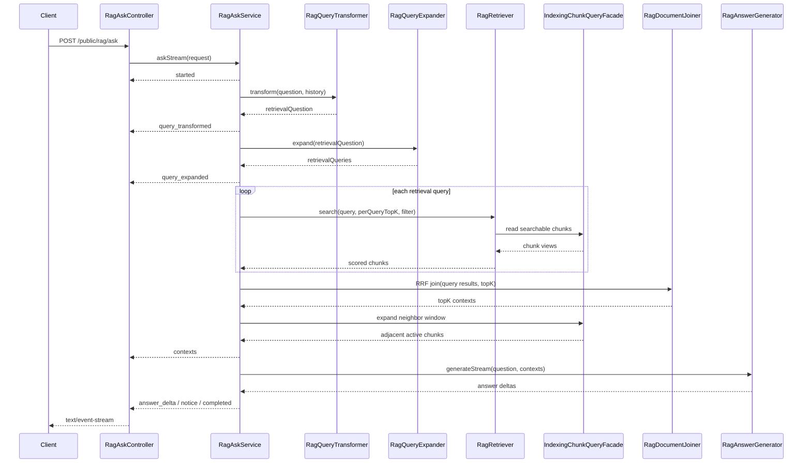

# 在线搜索链路技术文档

本文档梳理当前 RAG 在线搜索 / 问答链路的实现现状、关键配置、降级与观测能力，并给出后续可落地的演进方案。

## 1. 范围与入口

在线搜索链路由 `rag.retrieval` 模块负责，入口是：

- HTTP API：`POST /public/rag/ask`
- Response：`text/event-stream`，按 SSE 事件流返回
- Controller：`src/main/java/com/involutionhell/backend/rag/retrieval/web/RagAskController.java`
- Facade：`src/main/java/com/involutionhell/backend/rag/retrieval/api/RagAskFacade.java`
- Application Service：`src/main/java/com/involutionhell/backend/rag/retrieval/application/RagAskService.java`

模块边界上，`rag.retrieval` 不直接访问 indexing 的持久化实现，只通过 `rag.indexing::api` 暴露的 `IndexingChunkQueryFacade` 读取可检索 chunk，符合当前 Spring Modulith 约束。

## 2. 请求与响应契约

### 请求字段

`RagAskRequest` 支持：

- `question`：用户问题，必填。
- `topK`：最终返回上下文数量，范围 `1..10`，为空时使用 `rag.default-top-k`。
- `sourceUriPrefix`：按来源 URI 前缀过滤。
- `tags`：按文档标签过滤，当前语义检索可尝试下推到 Milvus，关键词检索在应用层二次过滤。
- `headingPathContains`：按 heading path 关键字过滤。
- `history`：对话历史，供 query compression 使用。

### 响应事件

`/ask` 当前只返回 SSE 流，不再返回 `ApiResponse<RagAnswerResponse>`。事件负载统一由 `RagAskStreamEvent` 包装，主要事件包括：

- `started`：返回 `correlationId`、原始问题和 `topK`。
- `query_transformed`：返回 query transform 结果。
- `query_expanded`：返回实际参与检索的 query 列表。
- `contexts`：一次性返回最终上下文片段。
- `answer_delta`：流式返回模型生成文本片段；本地 fallback 时返回一个完整片段。
- `notice`：返回阶段性降级提示。
- `completed`：返回 `generatedByModel`、`degraded`、`notices` 和 `contextCount`。
- `error`：流内错误事件。

## 3. 当前执行链路



主流程：

1. `RagAskService` 生成 `correlationId`，解析 `topK` 和 `RagSearchFilter`。
2. `RagQueryTransformer` 先按配置和阈值决定是否使用 Spring AI `CompressionQueryTransformer` 压缩多轮问题，再用 `RewriteQueryTransformer` 改写检索 query。
3. `RagQueryExpander` 使用 Spring AI `MultiQueryExpander` 生成多路检索 query；组件不可用或失败时回退为原始 query。
4. 每个 query 通过 WebFlux `Flux.flatMap` 并发调用当前注入的 `RagRetriever`，阻塞调用隔离到 `ragBlockingScheduler`。
5. 多 query 结果经 `RagDocumentJoiner` 使用 RRF 去重、融合、重排。
6. `RagAskService` 基于 `neighborWindowBefore/After` 补齐命中 chunk 前后的 active generation 邻居片段。
7. `RagAnswerGenerator` 使用 `ChatClient.stream().content()` 生成 `answer_delta`；没有上下文、没有 `ChatModel` 或调用失败时回退为本地摘要。

## 4. 检索策略

### 4.1 默认关键词检索

`KeywordRagRetriever` 是普通 `@Service`，在未启用 Milvus 时作为默认检索器使用。

执行逻辑：

1. `RagRetrievalScorer.extractTokens` 从问题中提取中英文 token，最多由 repository 侧保留前 8 个 token。
2. `IndexingChunkQueryFacade.findKeywordCandidates(tokens, candidateTopK)` 拉取候选。
3. `RagChunkMetadataHelper.matches` 在应用层执行 `sourceUriPrefix/tags/headingPathContains` 过滤。
4. `RagRetrievalScorer.keywordScore` 按 heading、title、content 加权统计 token 命中。
5. 按分数、documentId、chunkIndex 排序，截断到 `topK`。

PostgreSQL 下关键词候选使用：

- `to_tsvector('simple', headingPathText/title/chunk_text)` + `plainto_tsquery`
- 可选 `pg_trgm` 相似度
- `LIKE` 兜底

非 PostgreSQL 环境退化为 `LIKE` 检索，保证测试和本地开发可运行。

### 4.2 Milvus 语义检索

当 `rag.milvus.enabled=true` 且存在 `MilvusVectorStore` 时，`RagMilvusRetriever` 生效。

执行逻辑：

1. 构造 Spring AI `SearchRequest` 或 `MilvusSearchRequest`。
2. 若存在可下推过滤条件，`RagMilvusNativeExpressionBuilder` 生成 Milvus native expression。
3. 调用 `vectorStore.similaritySearch` 获取向量结果。
4. 从 Milvus metadata 中取 `vectorId` 和 `indexGeneration`。
5. 通过 `IndexingChunkQueryFacade.findSearchableByVectorIds` 回查当前 active generation 的 chunk。
6. 对齐 Milvus generation 与数据库 active generation，避免半提交向量进入在线上下文。
7. 使用 heading 命中对语义分数做轻量 rerank。

### 4.3 混合检索

当 Milvus 可用时，`HybridRagRetriever` 被标记为 `@Primary`，组合：

- `RagMilvusRetriever`
- `KeywordRagRetriever`

每路 retriever 取 `perRetrieverTopK`，再通过 RRF 融合为 `topK`。

当前实现中，semantic 和 keyword 分支在 `HybridRagRetriever` 内并发执行；单分支失败会记录 notice 并保留另一分支结果，两路都失败时返回空上下文并标记降级。

## 5. 融合与上下文扩展

`RagDocumentJoiner` 使用 RRF：

```text
score += 1 / (rrfK + rank + 1)
```

相同 chunk 通过 `chunkId` 去重；无 `chunkId` 时用 `documentId + chunkIndex` 兜底。排序优先级：

1. RRF 融合分数倒序。
2. 原始 retriever 最大分数倒序。
3. `documentId`。
4. `chunkIndex`。

最终 contexts 会再做邻居扩展：

- `rag.retrieval.neighbor-window-before`
- `rag.retrieval.neighbor-window-after`

邻居只读取当前文档 active generation，避免把旧版本索引内容拼进回答。

## 6. 关键配置

生产配置主要在 `src/main/resources/application-prod.properties`：

| 配置 | 默认值 | 作用 |
| --- | --- | --- |
| `rag.query-expansion.enabled` | `true` | 是否启用 query expansion |
| `rag.query-expansion.number-of-queries` | `3` | 期望扩写 query 数 |
| `rag.query-transformation.enabled` | `true` | 是否启用 query compression |
| `rag.query-transformation.rewrite-enabled` | `true` | 是否启用 query rewrite |
| `rag.retrieval.multi-query-per-query-multiplier` | `2` | 多 query 下每路 query 的候选倍数 |
| `rag.retrieval.multi-query-per-query-top-k-max` | `10` | 多 query 下每路 query 候选上限 |
| `rag.retrieval.query-concurrency` | `4` | 多 query 检索并发度 |
| `rag.retrieval.hybrid-per-retriever-multiplier` | `2` | 混合检索每路 retriever 候选倍数 |
| `rag.retrieval.hybrid-per-retriever-top-k-max` | `20` | 混合检索每路 retriever 候选上限 |
| `rag.retrieval.keyword-candidate-multiplier` | `8` | 关键词候选倍数 |
| `rag.retrieval.keyword-candidate-top-k-max` | `100` | 关键词候选上限 |
| `rag.retrieval.semantic-candidate-multiplier` | `3` | 语义候选倍数 |
| `rag.retrieval.semantic-filtered-candidate-multiplier` | `5` | 带过滤时语义候选倍数 |
| `rag.retrieval.semantic-candidate-top-k-max` | `50` | 语义候选上限 |
| `rag.retrieval.rrf-k` | `60.0` | RRF 融合参数 |
| `rag.retrieval.neighbor-window-before` | `1` | 向前扩展邻居 chunk 数 |
| `rag.retrieval.neighbor-window-after` | `1` | 向后扩展邻居 chunk 数 |
| `rag.retrieval.semantic-timeout-millis` | `1500` | 语义检索分支超时 |
| `rag.retrieval.keyword-timeout-millis` | `1500` | 关键词检索分支超时 |
| `rag.retrieval.query-timeout-millis` | `3000` | 设计上的单 query 总超时，当前未被 `RagAskService` 使用 |
| `rag.retrieval.answer-generation-timeout-millis` | `12000` | 回答生成流超时 |

## 7. 观测能力

当前已有：

- 结构化日志字段：`rag.ask.started`、`rag.ask.preprocessed`、`rag.ask.completed`。
- 指标组件：`RagRetrievalMetrics`。
- 分支耗时：`rag.retrieval.stage.duration`。
- 命中数量：`rag.retrieval.hit.count`。
- 请求数：`rag.retrieval.request.count`。
- 零命中数：`rag.retrieval.zero_hit.count`。
- fallback 计数接口：`rag.retrieval.fallback.count`。

当前缺口：

- `recordExpandedQueryCount` 尚未在主链路调用。
- fallback 计数接口已存在，但生成回退、检索分支降级未统一打点。
- `RagRequestFeedbacks` 已接入主链路，`notice` 与 `completed.degraded/notices` 会反映真实降级。
- query transform、query expansion、answer generation 缺少统一 stage duration 指标。

## 8. 已知问题与风险

1. Prompt 缺少上下文预算  
   邻居扩展后直接把所有 contexts 拼进 prompt，尚未按 token / char 预算裁剪；这会带来内存、成本和模型上下文溢出风险。

2. 关键词 SQL 仍有跨表和表达式计算压力  
   当前 FTS 依赖表达式索引和 `rag_documents` join，后续数据量增长后需要验证执行计划稳定性。

3. 测试覆盖仍需继续加深  
   当前已覆盖 SSE 契约、无上下文 fallback 与 hybrid 单分支降级；还缺少 filter、generation mismatch、neighbor window 与模型流式异常等更细场景。

## 9. 演进方案

### P1：上下文预算与 Prompt 保护

目标：让 prompt 拼接成本可控，避免上下文爆炸。

- 增加 `RagContextBudgeter`，按 token 和字符数裁剪 contexts。
- 配置建议：
  - `rag.retrieval.max-context-chars`
  - `rag.retrieval.max-context-tokens`
  - `rag.retrieval.max-history-messages`
  - `rag.retrieval.max-question-chars`
- 裁剪策略先保留高分 chunk，再尽量保留 seed chunk 的邻居；必要时对长 chunk 做局部截断。
- 在响应 notices 中标注 `context_trimmed`，便于前端提示。

### P2：PostgreSQL 关键词检索结构优化

目标：让关键词路径更稳定，减少复杂表达式和 join 带来的执行计划波动。

- 用 `scripts/rag/pgsql/explain_keyword_retrieval_current.sql` 和 `benchmark_keyword_retrieval.sh` 建立基准。
- 在生产库启用并验证 `scripts/rag/pgsql/enable_pg_trgm.sql`。
- 将 `title`、`headingPathText`、`documentTags` 等检索字段物化到 `rag_chunks`。
- 增加物化 `search_vector` 列和单一 GIN 索引，减少每次查询时拼接多个 `to_tsvector`。
- 评估 `LIKE` 兜底比例，必要时将兜底限制到短 query 或低召回场景。

### P4：召回质量策略

目标：在性能稳定后提升答案质量。

- 根据问题类型做策略路由：
  - 代码/API/报错：优先 keyword 或 keyword 权重更高。
  - 概念解释/开放问题：优先 hybrid。
  - 精确来源过滤：提高 filtered semantic candidate multiplier 或优先下推过滤。
- query expansion 改为自适应：短问题或高置信召回不扩写，低召回再追加扩写。
- 调整 heading/title/content/semantic boost 权重，建立离线评测集。
- 引入轻量 reranker 前，先完成基准集和指标闭环，避免盲调。

### P5：流式问答

- 支持重连续传和部分结果持久化。
- 对任务增加幂等、取消、超时、死信和审计日志。